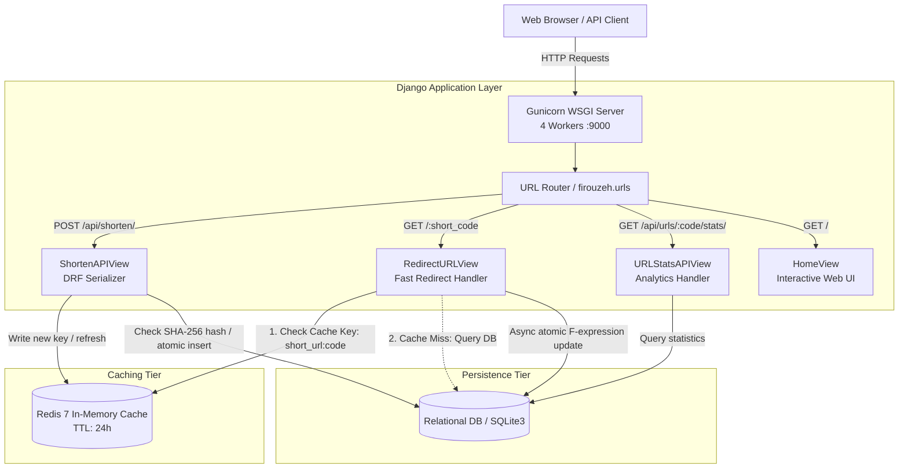
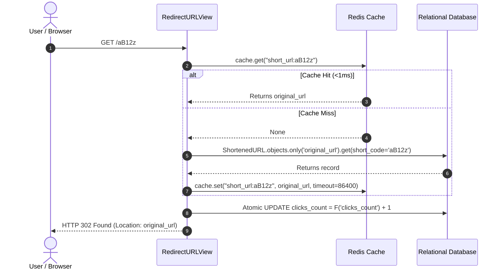

# Firouzeh Shortener &mdash; High-Performance URL Shortener Service

A production-grade, highly scalable URL Shortener service built with Python 3.12, Django 5, Django REST Framework, Redis, and Docker. It transforms long URLs into compact **5-character** Base62 short links, delivers sub-millisecond redirections through Redis in-memory caching, guarantees idempotent deduplication, and provides comprehensive automated test suites.

---

## Table of Contents

- [System Architecture](#-system-architecture)
- [Project Directory Structure](#-project-directory-structure)
- [Data Models & Database Design](#-data-models--database-design)
- [Redis Caching Strategy](#-redis-caching-strategy)
- [Preventing Duplication & Collision Handling](#-preventing-duplication--collision-handling)
- [Running the Project with Docker](#-running-the-project-with-docker)
- [Running Locally (Without Docker)](#-running-locally-without-docker)
- [REST API Reference](#-rest-api-reference)
- [Testing & Quality Assurance](#-testing--quality-assurance)

---

## 🏛 System Architecture

The service is designed around high-throughput, low-latency redirection and resilient link generation. It decouples high-frequency read operations from write operations through an in-memory cache tier backed by Redis.



### Architecture Highlights

1. **Gunicorn WSGI Application Server**: Configured with 4 concurrent worker processes handling asynchronous network I/O with process-level isolation.
2. **Read/Write Decoupling**:
   - **Write Path (`/api/shorten/`)**: Validates the input URL, checks for existing instances via SHA-256 indexing, generates a collision-free 5-character Base62 code inside an atomic transaction, persists the mapping, and primes the Redis cache.
   - **Read Path (`/<short_code>`)**: Evaluates the short code against the Redis cache in $<1\text{ms}$. Only on a cache miss does it query the database, immediately re-populating Redis for subsequent requests.
3. **Fault-Tolerant Cache Tier**: If Redis is temporarily unreachable or restarted, the cache client uses `IGNORE_EXCEPTIONS = True`, gracefully degrading to database queries without failing user requests.

---

## 📁 Project Directory Structure

```text
firouzeh/
├── Dockerfile                   # Multi-stage optimized Python 3.12-slim container build
├── docker-compose.yml           # Multi-container orchestration (web + redis)
├── requirements.txt             # Project dependencies (Django, DRF, django-redis, etc.)
├── manage.py                    # Django management script
├── .env.example                 # Environment variables template
├── firouzeh/                    # Core project configuration
│   ├── settings.py              # Django settings (Redis, security, DRF, cache fallbacks)
│   ├── urls.py                  # Root routing (API, Web UI, Admin, short-code redirection)
│   └── wsgi.py                  # Gunicorn WSGI entrypoint
├── shortener/                   # URL shortener application
│   ├── models.py                # ShortenedURL data model, indexes, and class methods
│   ├── serializers.py           # DRF Serializers with URL validation & normalization
│   ├── views.py                 # ShortenAPIView, RedirectURLView, URLStatsAPIView, HomeView
│   ├── urls.py                  # App-level API routing
│   ├── utils.py                 # Base62 generator, SHA-256 hasher, URL normalizer
│   ├── templates/               # Glassmorphic dark-mode web interface
│   ├── static/                  # Stylesheets, JavaScript, and UI assets
│   └── tests/                   # Full test coverage suite
```

---

## 🗄 Data Models & Database Design

The core data model is `ShortenedURL` defined in `shortener/models.py`.

### Schema Specification

| Field | Type | Attributes | Description |
| :--- | :--- | :--- | :--- |
| `id` | `BigAutoField` | Primary Key | Internal autoincrement ID |
| `original_url` | `URLField` | `max_length=2048` | Original target destination URL |
| `short_code` | `CharField` | `max_length=5`, `unique=True`, `db_index=True` | Unique 5-character Base62 identifier |
| `url_hash` | `CharField` | `max_length=64`, `db_index=True` | SHA-256 hex digest of `original_url` |
| `clicks_count` | `PositiveBigIntegerField` | `default=0` | Total redirection clicks recorded |
| `created_at` | `DateTimeField` | `auto_now_add=True` | Creation timestamp |
| `last_accessed_at` | `DateTimeField` | `null=True`, `blank=True` | Timestamp of the most recent redirection |

### Database Indexing

```python
indexes = [
    models.Index(fields=['short_code'], name='idx_short_code'),
    models.Index(fields=['url_hash'], name='idx_url_hash'),
]
```

- **`idx_short_code`**: Enables $O(1)$ B-Tree lookups on redirection (`GET /<short_code>`).
- **`idx_url_hash`**: Enables instantaneous lookups when checking whether a long URL has already been shortened, avoiding slow text indexing on variable-length URLs.

### Why Base62 for 5-Character Constraint?

- **Alphabet**: `0-9`, `a-z`, `A-Z` (62 distinct alphanumeric characters).
- **Capacity**: $62^5 = 916,132,832$ (~916 million) unique combinations.
- **Safety**: Unlike Base64 (`+`, `/`, `=`), Base62 contains no characters that require percent-encoding or cause breaking issues in SMS, emails, or messaging applications.

---

## ⚡ Redis Caching Strategy

The project utilizes `django-redis` as its primary caching layer, providing high throughput for read-heavy redirection traffic.

### 1. Dual-Mode Cache Configuration

In `firouzeh/settings.py`, the cache engine dynamically switches based on whether `REDIS_URL` is set:

```python
if REDIS_URL:
    CACHES = {
        'default': {
            'BACKEND': 'django_redis.cache.RedisCache',
            'LOCATION': REDIS_URL,
            'TIMEOUT': 86400,  # 24 hours
            'OPTIONS': {
                'CLIENT_CLASS': 'django_redis.client.DefaultClient',
                'MAX_ENTRIES': 100000,
                'IGNORE_EXCEPTIONS': True,  # High availability: fall back to DB on Redis failure
            },
        }
    }
else:
    CACHES = {
        'default': {
            'BACKEND': 'django.core.cache.backends.locmem.LocMemCache',
            'LOCATION': 'url-shortener-cache',
            'TIMEOUT': 86400,
        }
    }
```

### 2. Read-Through Cache Workflow



1. **Standardized Key Scheme**: `short_url:<short_code>` (e.g., `short_url:k9A2x`).
2. **Cache-Aside Population**: When a new short URL is created via `ShortenedURL.create_or_get()`, the cache entry is immediately populated so the very first redirection is already warmed.
3. **Non-Blocking Analytics**: Click counters use Django `F('clicks_count') + 1` expressions in a single raw `UPDATE` query without reading or locking full model rows.

---

## 🛡 Preventing Duplication & Collision Handling

The service implements two distinct levels of deduplication and collision prevention:

### 1. Preventing Duplicate URLs (Deduplication)

Submitting the exact same long URL multiple times **does not** generate multiple short codes. It returns the existing short link idempotently.

- **The Problem**: Long URLs can span thousands of characters. Indexing raw URLs in relational databases exceeds index prefix length limits and degrades performance.
- **The Solution**:
  1. The incoming URL is normalized (trimmed, scheme ensured: `https://`, validated syntax).
  2. A 64-character SHA-256 hex digest is calculated:
     $$\text{url\_hash} = \text{SHA-256}(\text{normalized\_url})$$
  3. The database is checked for a match:
     ```python
     existing = ShortenedURL.objects.filter(url_hash=url_hash, original_url=original_url).first()
     if existing:
         return existing, False  # is_new = False
     ```
  4. If found, the existing `ShortenedURL` instance is returned, its cache is refreshed, and no redundant rows are created.

### 2. Preventing Short Code Collisions

When generating random 5-character Base62 short codes, collisions could theoretically occur as capacity fills or across concurrent worker processes:

1. **Cryptographically Secure Entropy**: Codes are generated using `secrets.choice(BASE62_ALPHABET)`.
2. **Atomic Transaction & Integrity Guard**:
   ```python
   for _ in range(max_attempts):
       candidate_code = generate_short_code(length=5)
       try:
           with transaction.atomic():
               instance = ShortenedURL.objects.create(
                   original_url=original_url,
                   short_code=candidate_code,
                   url_hash=url_hash,
               )
               return instance, True
       except IntegrityError:
           # Handled if short_code collided or another worker inserted the same URL
           existing = ShortenedURL.objects.filter(url_hash=url_hash, original_url=original_url).first()
           if existing:
               return existing, False
           continue
   ```
3. If an `IntegrityError` is caught (either duplicate `short_code` or concurrent duplicate URL insertion), the algorithm either reuses the record created by the competing process or generates a new random code.

---

## 🐳 Running the Project with Docker

The easiest and recommended way to run the service in production or local evaluation is via Docker Compose. This starts both the Django application (via Gunicorn) and the Redis caching server.

### 1. Prerequisites

- [Docker Engine](https://docs.docker.com/engine/install/) (version 20.10+)
- [Docker Compose](https://docs.docker.com/compose/) (version 2.0+)

### 2. Configure Environment Variables

Create your `.env` file from the provided template:

```bash
cp .env.example .env
```

Generate a secure Django secret key and update your `.env`:

```bash
python3 -c "from django.core.management.utils import get_random_secret_key; print(get_random_secret_key())"
```

Example `.env` configuration:

```env
DJANGO_SECRET_KEY=your-generated-secret-key-here
DJANGO_DEBUG=False
DJANGO_ALLOWED_HOSTS=*
DJANGO_CSRF_TRUSTED_ORIGINS=
SHORTENER_BASE_URL=
```

### 3. Build and Start Services

Launch the multi-container stack in detached mode:

```bash
docker compose up --build -d
```

Docker Compose performs the following steps automatically:
1. Pulls and starts the **Redis 7** container with health checks.
2. Builds the **Python 3.12-slim** image and installs dependencies.
3. Automatically runs database migrations (`python manage.py migrate --noinput`).
4. Collects static assets (`python manage.py collectstatic`).
5. Launches **Gunicorn** with 4 workers listening on `0.0.0.0:9000`.

### 4. Verify Running Containers

```bash
docker compose ps
```

Check the live logs:

```bash
docker compose logs -f web
```

### 5. Access the Services

- **Interactive Web Interface**: [http://localhost:9000/](http://localhost:9000/)
- **REST API Endpoint**: [http://localhost:9000/api/shorten/](http://localhost:9000/api/shorten/)
- **Django Admin Panel**: [http://localhost:9000/admin/](http://localhost:9000/admin/)

### 6. Useful Docker Commands

```bash
# Create an admin superuser
docker compose exec web python manage.py createsuperuser

# Run automated tests inside the container
docker compose exec web python manage.py test shortener

# Inspect Redis cache keys
docker compose exec redis redis-cli keys "short_url:*"

# Stop and remove containers
docker compose down
```

---

## 💻 Running Locally (Without Docker)

If you prefer to run the application directly on your local host system:

### 1. Set Up Virtual Environment

```bash
# Clone and navigate to repository
cd /Users/farhad/Downloads/firouzeh

# Create and activate virtual environment
python3 -m venv .venv
source .venv/bin/activate

# Install dependencies
pip install -r requirements.txt
```

### 2. Apply Migrations & Run Development Server

```bash
# Apply database migrations
python manage.py migrate

# (Optional) Create superuser
python manage.py createsuperuser

# Start development server
python manage.py runserver 127.0.0.1:8000
```

Access the application at [http://127.0.0.1:8000/](http://127.0.0.1:8000/). In local mode without `REDIS_URL`, the application automatically uses high-speed `LocMemCache`.

---

## 📡 REST API Reference

### 1. Shorten a Long URL

- **Endpoint**: `POST /api/shorten/`
- **Headers**: `Content-Type: application/json`
- **Request Body**:
  ```json
  {
    "url": "https://en.wikipedia.org/wiki/URL_shortening"
  }
  ```

- **Response (201 Created - New URL)**:
  ```json
  {
    "status": "success",
    "short_code": "k8X2p",
    "short_url": "http://localhost:9000/k8X2p",
    "original_url": "https://en.wikipedia.org/wiki/URL_shortening",
    "is_new": true,
    "created_at": "2026-09-05T00:30:00.000000+00:00"
  }
  ```

- **Response (200 OK - Deduplicated Existing URL)**:
  ```json
  {
    "status": "success",
    "short_code": "k8X2p",
    "short_url": "http://localhost:9000/k8X2p",
    "original_url": "https://en.wikipedia.org/wiki/URL_shortening",
    "is_new": false,
    "created_at": "2026-09-05T00:30:00.000000+00:00"
  }
  ```

---

### 2. Redirect to Original Destination

- **Endpoint**: `GET /<short_code>` (e.g., `GET /k8X2p`)
- **Status Code**: `302 Found`
- **Header**: `Location: https://en.wikipedia.org/wiki/URL_shortening`
- **Behavior**: Atomically increments click counter, updates `last_accessed_at`, and redirects the client.

---

### 3. Retrieve Link Statistics

- **Endpoint**: `GET /api/urls/<short_code>/stats/`
- **Headers**: `Accept: application/json`
- **Response (200 OK)**:
  ```json
  {
    "status": "success",
    "short_code": "k8X2p",
    "short_url": "http://localhost:9000/k8X2p",
    "original_url": "https://en.wikipedia.org/wiki/URL_shortening",
    "clicks_count": 42,
    "created_at": "2026-09-05T00:30:00.000000+00:00",
    "last_accessed_at": "2026-09-05T01:15:22.000000+00:00"
  }
  ```

- **Response (404 Not Found)**:
  ```json
  {
    "status": "error",
    "message": "Short code not found."
  }
  ```

---

## 🧪 Testing & Quality Assurance

The test suite covers unit tests, API integration tests, deduplication, caching behaviors, and edge cases.

### Running the Test Suite

```bash
# Using Django's test runner
python manage.py test shortener

# Or using pytest
pytest
```

### Test Coverage Highlights

- **Base62 Character & Length Validation**: Ensures short codes strictly adhere to length $\le 5$ and characters belong to `[0-9a-zA-Z]`.
- **Deduplication Verification**: Confirms that submitting identical URLs produces the identical short code with `is_new: false`.
- **Cache Hit Verification**: Validates that cache hits resolve redirection destinations without hitting the database.
- **Atomic Click Counter Verification**: Confirms that redirects increment `clicks_count` and update `last_accessed_at`.
- **Error Handling**: Validates responses for empty URLs, malformed schemes, oversized lengths, and non-existent short codes.
