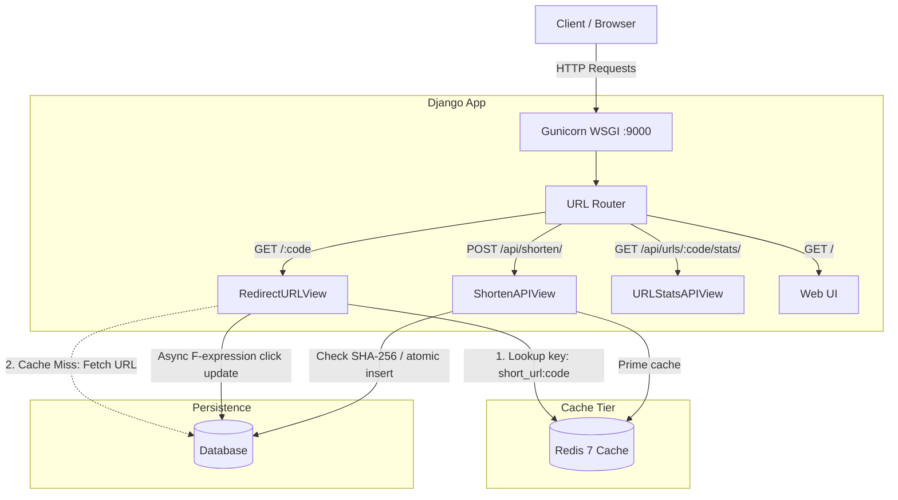

# Firouzeh Shortener &mdash; High-Performance URL Shortener

A production-grade URL Shortener service built with Python 3.12, Django 5, Django REST Framework, Redis, and Docker. Converts long URLs into compact **5-character alphanumeric** short links (`[0-9a-zA-Z]`), serves sub-millisecond redirects with Redis caching, guarantees idempotent deduplication, and includes automated test suites.

---

## 🏛 System Architecture

The service decouples high-frequency read operations (redirections) from write operations (shortening) through an in-memory Redis cache tier.



### Key Highlights

- **Read/Write Decoupling**: Redirects check Redis first (`< 1ms`). Cache misses fall back to the database and re-prime Redis.
- **Fault-Tolerant Cache**: If Redis is unreachable, `IGNORE_EXCEPTIONS = True` allows transparent fallback to the database without request failures.
- **Non-blocking Analytics**: Redirection click counts use atomic Django `F('clicks_count') + 1` expressions in a single query without reading or locking full model rows.

---

## 🗄 Data Models & Database Design

The core data model is `ShortenedURL` in `shortener/models.py`:

| Field | Type | Attributes | Description |
| :--- | :--- | :--- | :--- |
| `original_url` | `URLField` | `max_length=2048` | Original target destination URL |
| `short_code` | `CharField` | `max_length=5`, `unique=True`, `db_index=True` | Unique 5-character alphanumeric ID |
| `url_hash` | `CharField` | `max_length=64`, `db_index=True` | SHA-256 hex digest of `original_url` |
| `clicks_count` | `PositiveBigIntegerField` | `default=0` | Total redirection clicks |
| `created_at` | `DateTimeField` | `auto_now_add=True` | Creation timestamp |
| `last_accessed_at` | `DateTimeField` | `null=True`, `blank=True` | Last accessed timestamp |

**Indexes**:
- `idx_short_code`: Fast O(1) B-tree lookup for `GET /<short_code>`.
- `idx_url_hash`: Instant lookup to check if a long URL was already shortened.

---

## 🔑 Short Code Generation (Clarification on "Base62")

The project **does not use sequential Base62 integer encoding** (converting auto-incrementing database IDs `123 -> "1Z"`).

Instead, it uses **cryptographically secure random token sampling** (`secrets.choice`) over the 62-character alphanumeric set (`[0-9a-zA-Z]`):

```python
# shortener/utils.py
SHORT_CODE_CHARACTERS = string.digits + string.ascii_letters  # 62 characters

def generate_short_code(length: int = 5) -> str:
    return ''.join(secrets.choice(SHORT_CODE_CHARACTERS) for _ in range(length))
```

### Why Random Sampling Instead of Sequential Base62?

1. **Security & Privacy**: Sequential encoding (`1 -> '1'`, `2 -> '2'`) makes all links predictable and easily scrapable by incrementing numbers. Random sampling prevents enumeration and hides business volume.
2. **Fixed 5-Character Length**: Sequential encoding starts at 1 character and takes millions of records to reach 5 characters. Random sampling guarantees **exactly 5 characters** from day one.
3. **Capacity**: `62^5 = 916,132,832` (~916 million) unique combinations.
4. **URL-Safe**: `[0-9a-zA-Z]` requires no percent-encoding and does not break in SMS or chat apps.

---

## ⚡ Redis Caching Strategy

- **Dual-Mode Cache**: Automatically uses Redis (`django_redis.cache.RedisCache`) when `REDIS_URL` is set; falls back to `LocMemCache` for local development without Redis.
- **Cache Keys & TTL**: Stored as `short_url:<short_code>` with a 24-hour TTL (`SHORT_URL_CACHE_TTL = 86400`).
- **Read-Through Flow**:
  1. `cache.get("short_url:<short_code>")`
  2. Cache hit: returns `original_url` immediately (`< 1ms`).
  3. Cache miss: queries DB (`.only('original_url')`), stores in Redis, then redirects.
- **Cache Warming**: Populated immediately upon URL creation in `create_or_get()`.

---

## 🛡 Preventing Duplication & Collisions

1. **URL Deduplication (Idempotent Creation)**:
   - URLs can be thousands of characters, exceeding standard DB index limits.
   - Long URLs are normalized (`https://`, trimmed) and converted to a fixed 64-character SHA-256 hash:
     ```text
     url_hash = SHA-256(normalized_url)
     ```
   - Before insertion, the DB is checked:
     ```python
     existing = ShortenedURL.objects.filter(url_hash=url_hash, original_url=original_url).first()
     if existing:
         return existing, False  # is_new = False
     ```
   - Submitting the same URL reuses the existing short code without creating duplicate rows.

2. **Short Code Collision Handling**:
   - Short codes are created inside an atomic transaction:
     ```python
     with transaction.atomic():
         instance = ShortenedURL.objects.create(
             original_url=original_url,
             short_code=candidate_code,
             url_hash=url_hash,
         )
     ```
   - If an `IntegrityError` occurs (code collision or race condition with another worker), the system retries with a new code or reuses the concurrent insertion (up to 100 attempts).

---

## 🐳 Running with Docker

Docker Compose runs the Django application (via Gunicorn with 4 workers) alongside a Redis 7 Alpine cache.

### 1. Setup Environment
```bash
cp .env.example .env
```
Set `DJANGO_SECRET_KEY` in `.env`:
```bash
python3 -c "from django.core.management.utils import get_random_secret_key; print(get_random_secret_key())"
```

### 2. Start Containers
```bash
docker compose up --build -d
```
Migrations and static collection run automatically on startup.

### 3. Service URLs
- **Web Interface**: [http://localhost:9000/](http://localhost:9000/)
- **API Endpoint**: [http://localhost:9000/api/shorten/](http://localhost:9000/api/shorten/)
- **Admin Panel**: [http://localhost:9000/admin/](http://localhost:9000/admin/)

### 4. Useful Commands
```bash
# View logs
docker compose logs -f web

# Create superuser
docker compose exec web python manage.py createsuperuser

# Run tests
docker compose exec web python manage.py test shortener

# Inspect Redis cache
docker compose exec redis redis-cli keys "short_url:*"

# Stop containers
docker compose down
```

---

## 💻 Running Locally (Without Docker)

```bash
# Setup virtual environment
python3 -m venv .venv
source .venv/bin/activate
pip install -r requirements.txt

# Run migrations & start server
python manage.py migrate
python manage.py runserver 127.0.0.1:8000
```

---

## 📡 REST API Reference

### 1. Shorten a URL
- **Endpoint**: `POST /api/shorten/`
- **Request**:
  ```json
  {
    "url": "https://en.wikipedia.org/wiki/URL_shortening"
  }
  ```
- **Response (`201 Created` or `200 OK` if existing)**:
  ```json
  {
    "status": "success",
    "short_code": "k8X2p",
    "short_url": "http://localhost:9000/k8X2p",
    "original_url": "https://en.wikipedia.org/wiki/URL_shortening",
    "is_new": true,
    "created_at": "2026-09-05T00:30:00.000000+00:00"
  }
  ```

### 2. Redirect
- **Endpoint**: `GET /<short_code>`
- **Response**: `HTTP 302 Found` with `Location: <original_url>` (increments click counter).

### 3. URL Statistics
- **Endpoint**: `GET /api/urls/<short_code>/stats/`
- **Response (`200 OK`)**:
  ```json
  {
    "status": "success",
    "short_code": "k8X2p",
    "short_url": "http://localhost:9000/k8X2p",
    "original_url": "https://en.wikipedia.org/wiki/URL_shortening",
    "clicks_count": 42,
    "created_at": "2026-09-05T00:30:00.000000+00:00",
    "last_accessed_at": "2026-09-05T01:15:22.000000+00:00"
  }
  ```

---

## 🧪 Testing

```bash
# Run tests with Django
python manage.py test shortener

# Or with pytest
pytest
```

**Coverage**: Alphanumeric short code length (`<= 5`), idempotent deduplication, cache hits/misses, HTTP 302 redirection, atomic click tracking, and invalid input validation.
